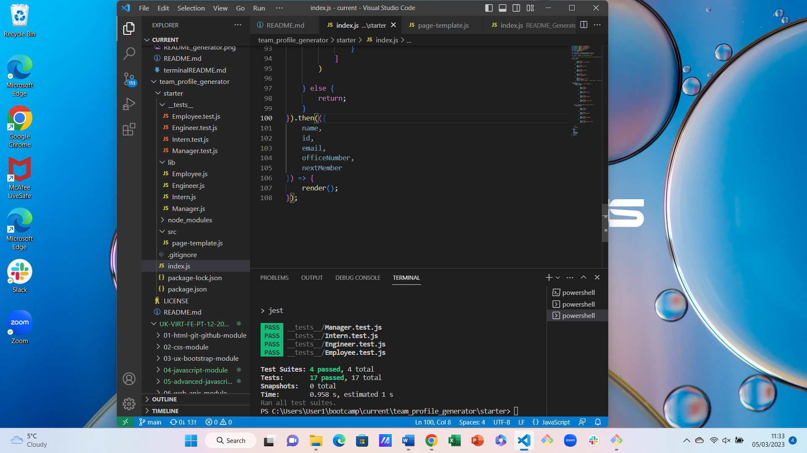

# team_profile_generator
Week 12 Challenge Team Profile Generator
# Module 12 Object-Oriented Programming: Team Profile Generator

[]

## Description
I wanted to create a team profile html generator using ES6 and Node.js.
The app enables the user to create a development team by using prompt questions and using node.js to render those questions to a newly created, or updated, html file.
I reinforced last week's learning on how to use Node.js, fs and inquirer. I learned new concepts and put them into use, namely how to use ES6 classes in JavaScript and some basics of test driven development.

## Installation
The app is run from within the JavaScript file. The user should open the integrated terminal and use the command 'node index.js' or simply 'node index'.
There are no other installation requirements.

## Usage
When the user enters 'node index.js' a series of prompt questions is displayed on screen in the integrated terminal.

In the development of the app, I ran tests using "npm run test" after adapting the files Employee.js, Engineer.js, Intern.js and Manager.js Once these had passed I took a screenshot to show that this had been achieved. The screenshot is here:

Once the user has completed answering all the questions, the team.html file is automatically generated within the output folder.

## License
I selected the MIT license for this app.

## Badges
Two badges have been added, one for the contributor covenant, the other for the MIT license.

## How to Contribute
Other developers are welcome to contribute. For this, I have included the Contributor Covenant.

Developers wishing to report problems can email me on philculling@hotmail.com.

## Credits
Some help was received from AskBCS. Specifically, lines 156 to 159 were explained and suggested after I made a request for help to link index.js to the required output.

TO DO LIST
Commit.
Check submission requirements. See below.
Update this README to get rid of to do list notes!

## Review

You are required to submit the following for review:

* A sample HTML file generated using your application.

* The URL of the GitHub repository, with a unique name and a readme describing the project.